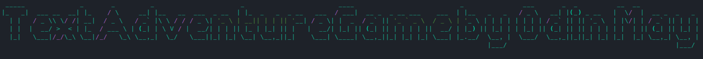
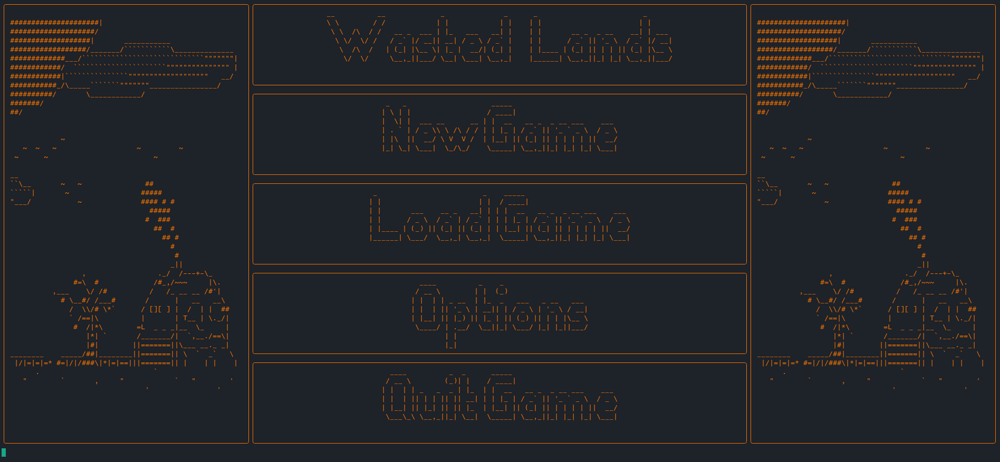
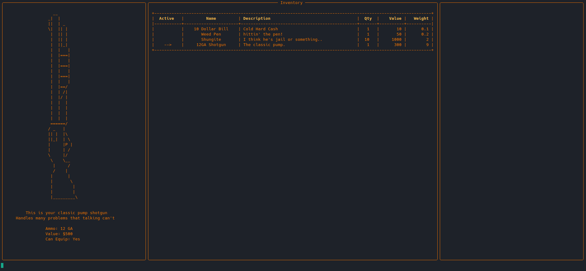

<!-- PROJECT SHIELDS -->
<!--
*** I'm using markdown "reference style" links for readability.
*** Reference links are enclosed in brackets [ ] instead of parentheses ( ).
*** See the bottom of this document for the declaration of the reference variables
*** for contributors-url, forks-url, etc. This is an optional, concise syntax you may use.
*** https://www.markdownguide.org/basic-syntax/#reference-style-links
-->

[//]: # ([![Contributors][contributors-shield]][contributors-url])

[//]: # ([![Forks][forks-shield]][forks-url])

[//]: # ([![Stargazers][stars-shield]][stars-url])

[//]: # ([![Issues][issues-shield]][issues-url])

[//]: # ([![MIT License][license-shield]][license-url])

[//]: # ([![LinkedIn][linkedin-shield]][linkedin-url])

<!-- PROJECT LOGO -->
 

  

  <h3 align="center">TextAdventureGame </h3>

  

    If only I could think of a name..
     
     
    Well this is just a current passion project that I am working on. Something I have been wanting to do for a while now has been to make a text based game. I love Zork but didn't want to make something that played like it. After months waiting for an idea to come up I finally have it and this is my attempt at implementing it. I am building the game using Python with the help of a formatting framework called rich. The framework of the game is currently being developed and the process refined. The game draws the screens in a clever way and uses the keyboard library to handle key events which will drive the UI.
     
     
    <a href="https://github.com/odinmay/AdventureGame/issues">Report Bug</a>
    ·
    <a href="https://github.com/odinmay/AdventureGame/issues">Request Feature</a>
  

[//]: # (<!-- TABLE OF CONTENTS -->)

[//]: # (
)

[//]: # (  
Table of Contents
)

[//]: # (  <ol>)

[//]: # (    <li>)

[//]: # (      <a href="#about-the-project">About The Project</a>)

[//]: # (      <ul>)

[//]: # (        <li><a href="#built-with">Built With</a></li>)

[//]: # (      </ul>)

[//]: # (    </li>)

[//]: # (    <li>)

[//]: # (      <a href="#getting-started">Getting Started</a>)

[//]: # (      <ul>)

[//]: # (        <li><a href="#prerequisites">Prerequisites</a></li>)

[//]: # (        <li><a href="#installation">Installation</a></li>)

[//]: # (      </ul>)

[//]: # (    </li>)

[//]: # (    <li><a href="#usage">Usage</a></li>)

[//]: # (    <li><a href="#roadmap">Roadmap</a></li>)

[//]: # (    <li><a href="#contributing">Contributing</a></li>)

[//]: # (    <li><a href="#license">License</a></li>)

[//]: # (    <li><a href="#contact">Contact</a></li>)

[//]: # (    <li><a href="#acknowledgments">Acknowledgments</a></li>)

[//]: # (  </ol>)

[//]: # (
)

<!-- ABOUT THE PROJECT -->
## About The Project

### Main Menu

### Inventory(WIP)

The basic idea:
* The image above is super rough and incomplete but shows a prototype of the HUD below and the MAP above
* I added some bars to the side in honor of 4:3, forever in our hearts, I think I will be using these for storing some information about the map, sort of like a legend.
* The game as far as I can assume at the moment will be played similar to XCOM in top down 2D fashion. Think of the grid above as the tiles and indicators will go within each square to specify what the tile is and its properties.
* The game will be more open ended than XCOM with the ability to loot things and have unique interactions depending on the tile. This will allow for a robust gameplay cycle that rewards exploration
* Levels can be loaded on arrival at a specific spot or condition and there may be a world map of sorts and smaller locations that you can go to and load into them
* There will be an economy, all items will have a value/weight and you will be able to buy and sell with traders
* There may eventually be quests but that is low priority
* There will be statistics for things like , objects looted , enemies killed. These will have their own class and get serialized and saved so they remain persistent.
* I am unsure if there will be pitfalls to this, but I am considering a save system with serializes a main Game class that all other classes will be within, and saving that will allow the game to be loaded. gee, I hope that works.

(<a href="#top">back to top</a>)

### Built With

These are the Python libraries I currently use for this game

* [rich](https://github.com/Textualize/rich)
* `pip install rich`
* [art](https://github.com/sepandhaghighi/art)
* `pip install art`
* [keyboard](https://github.com/boppreh/keyboard)
* `pip install keyboard`

(<a href="#top">back to top</a>)

<!-- ROADMAP -->
## Roadmap

- [x] Pause Menu Proof of concept
- [x] Create Main Game Layout
- [x] Implement a Boot screen
- [ ] Implement Options menu with font/color option
- [ ] Create a custom theme
    - [ ] Create a second theme
    - [ ] Implement a change theme option
- [ ] Brainstorm a setting. (Post-apocolyptic)
- [x] Find standard grid boundaries
- [ ] Implement a mapping/factory for assigning tile instances to the board grid
  - [ ] Get input for this factory method from a text file. This will allow levels to be saved as text codes into a file and read in line by line
- [x] Create an example map
  - [ ] Add spawn point for player
- [ ] Implement logic for tiles knowing their location/neighbors
- [ ] Character creation screen/prompts
- [x] Implement an inventory screen using rich Tables
  - [x] Make inventory usable (navigate logic)
- [ ] Create equip methods on player so equipable items/weapons can attach to player

 

See the [open issues](https://github.com/odinmay/AdventureGame/issues) for a full list of proposed features (and known issues).

(<a href="#top">back to top</a>)

<!-- CONTRIBUTING -->
## Contributing

Contributions are what make the open source community such an amazing place to learn, inspire, and create. Any contributions you make are **greatly appreciated**. It is VERY early currently so it will be hard to know where to contribute but if you have ideas or requests please reach out to me

If you have a suggestion that would make this better, please fork the repo and create a pull request. You can also simply open an issue with the tag "enhancement".

1. Fork the Project
2. Create your Feature Branch (`git checkout -b feature/AmazingFeature`)
3. Commit your Changes (`git commit -m 'Add some AmazingFeature'`)
4. Push to the Branch (`git push origin feature/AmazingFeature`)
5. Open a Pull Request

(<a href="#top">back to top</a>)

<!-- CONTACT -->
## Contact

Odin May - [Email Me!](mailto:odinmerlinmay@gmail.com) - odinmerlinmay@gmail.com

Project Link: [https://github.com/odinmay/AdventureGame](https://github.com/odinmay/AdventureGame)

 

<!-- ACKNOWLEDGMENTS -->
## Acknowledgments

So I am taking a lot of inspiration from XCOM and the original Fallout as well as Zork which is the game that inspired the project in the first place. Another game that I think really triggered the idea was Ashes Afterglow, which is a Doom 2 total conversion WAD. The way I am going to approach levels comes largely from Doom WADS as well and their "Hub" style of connecting the world, if you are interested in any of these things I will include links below. Please enjoy!

* [Zork](https://playclassic.games/games/adventure-dos-games-online/play-zork-great-underground-empire-online/)
* [Fallout 1](https://store.steampowered.com/app/38400/Fallout_A_Post_Nuclear_Role_Playing_Game/)
* [XCOM](https://store.steampowered.com/app/268500/XCOM_2/)
* [Ashes Afterglow](https://forum.zdoom.org/viewtopic.php?t=69612)

(<a href="#top">back to top</a>)

<!-- MARKDOWN LINKS & IMAGES -->
<!-- https://www.markdownguide.org/basic-syntax/#reference-style-links -->
[contributors-shield]: https://img.shields.io/github/contributors/othneildrew/Best-README-Template.svg?style=for-the-badge
[contributors-url]: https://github.com/othneildrew/Best-README-Template/graphs/contributors
[forks-shield]: https://img.shields.io/github/forks/othneildrew/Best-README-Template.svg?style=for-the-badge
[forks-url]: https://github.com/othneildrew/Best-README-Template/network/members
[stars-shield]: https://img.shields.io/github/stars/othneildrew/Best-README-Template.svg?style=for-the-badge
[stars-url]: https://github.com/othneildrew/Best-README-Template/stargazers
[issues-shield]: https://img.shields.io/github/issues/othneildrew/Best-README-Template.svg?style=for-the-badge
[issues-url]: https://github.com/othneildrew/Best-README-Template/issues
[license-shield]: https://img.shields.io/github/license/othneildrew/Best-README-Template.svg?style=for-the-badge
[license-url]: https://github.com/othneildrew/Best-README-Template/blob/master/LICENSE.txt
[linkedin-shield]: https://img.shields.io/badge/-LinkedIn-black.svg?style=for-the-badge&logo=linkedin&colorB=555
[linkedin-url]: https://linkedin.com/in/othneildrew
[product-screenshot]: images/screenshot.png
